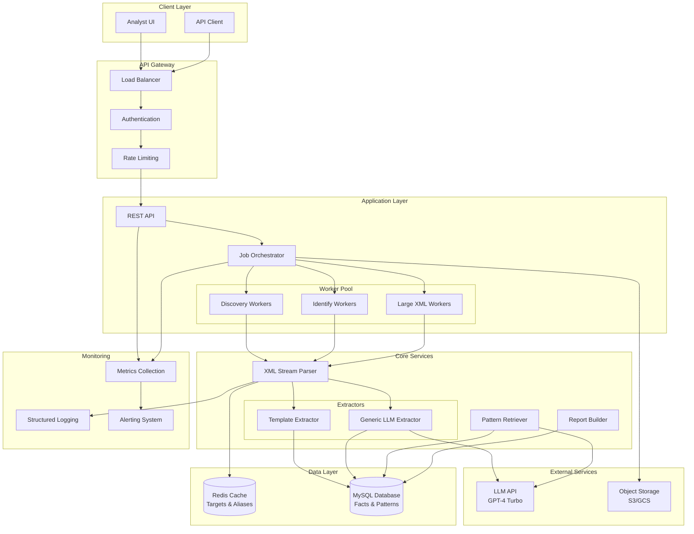
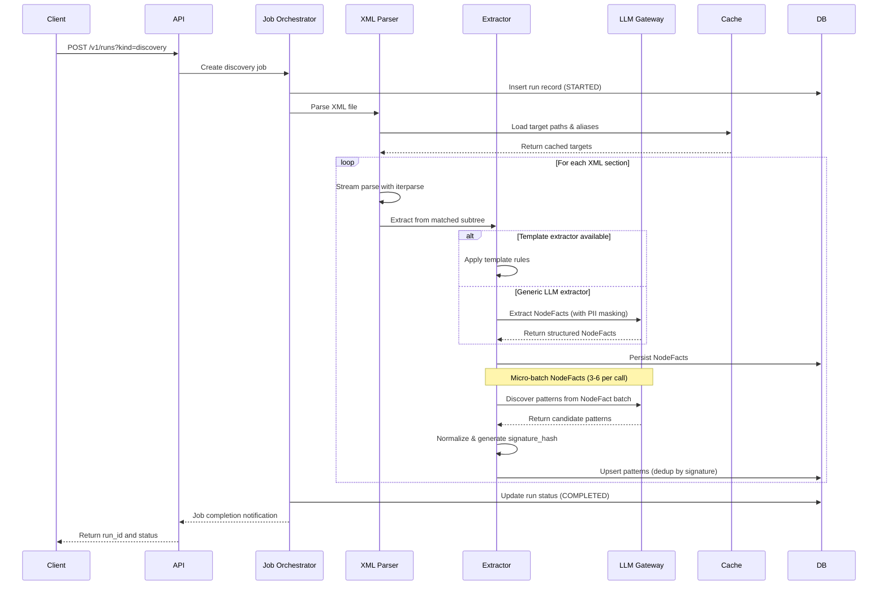
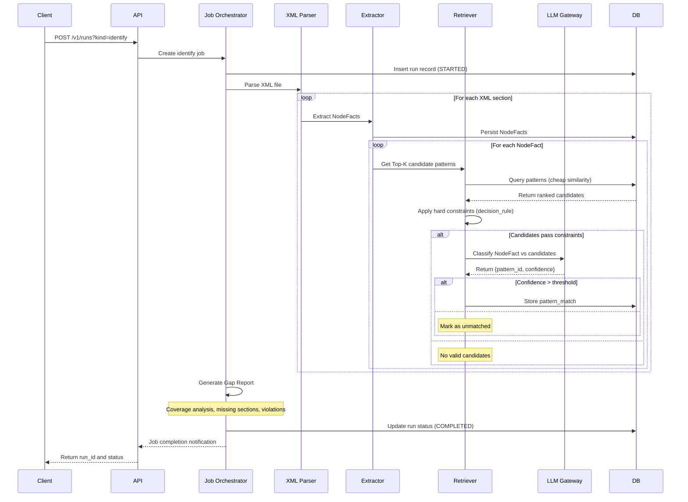
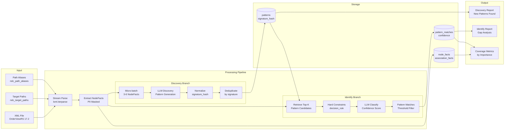
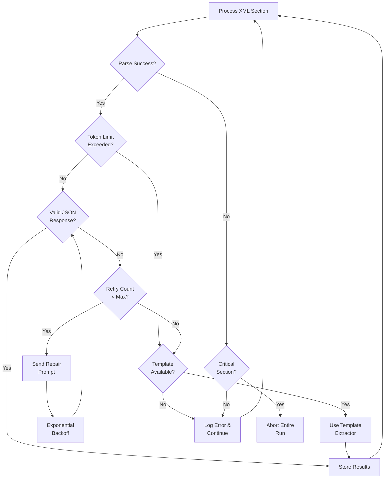

# AssistedDiscovery — Comprehensive Enhanced Design Document

Prepared for review and presentation · 26 Sep 2025, Enhanced Version

## 1. Executive Summary

AssistedDiscovery provides deterministic, token‑efficient extraction and pattern learning over airline NDC XMLs to power discovery of reusable business patterns and identification/classification in new files. The system streams XML with lxml.iterparse, targets only high‑signal sections per (spec_version, message_root), emits compact PII‑masked NodeFacts, and uses micro‑batched LLM calls for pattern discovery and classification. This enhanced document details architecture, data model, flows (Discovery & Identify), performance, security, comprehensive implementation plan, testing, and operational excellence practices.

## 2. Problem Statement & Goals

**Problems Today**
- Non‑deterministic pattern counts across runs; unstable outputs.
- Token‑limit failures on large XMLs due to whole‑document prompting.
- Unnecessary pattern generation for low‑signal nodes.
- Identify path also hits token limits on huge inputs.

**Goals**
- Deterministic, repeatable extraction using curated targets per spec version & message root.
- Token‑efficient streaming parse; micro‑batched LLM calls (3–6 facts).
- Stable pattern catalog via de‑duplication (signature_hash).
- Identify pipeline that retrieves Top‑K candidates cheaply, then classifies via LLM with hard validations.

**Non‑Goals (MVP)**
- Full XSD validation of every NDC version.
- Embeddings‑based retrieval (may be added later).
- Cross‑message orchestration beyond a single XML run.

## 3. High‑Level Architecture

Core components: API, Job Orchestrator, XML Stream Parser, Extractors (template or generic LLM), LLM Gateway, Ranker/Retriever, Dedup/Versioning, Report Builder, and MySQL storage (Catalog + Facts/Patterns).

### System Architecture Diagram



## 4. End‑to‑End Flow

### Discovery Flow Sequence Diagram



### Identify Flow Sequence Diagram



### Common Steps (per file upload)
1) Detect message_root and spec_version from root tag/namespace.
2) Resolve targets; apply alias fallback if exact version missing.
3) Stream XML with iterparse; when stack path matches a target, yield subtree and clear for O(1) memory.
4) Extract NodeFacts: PII‑masked summaries with ids/refs; persist to MySQL; build in‑run ID indexes and optional AssociationFacts.

### Discovery
1) Group NodeFacts per section and micro‑batch (3–6) into LLM with strict JSON schema.
2) Normalize candidate Patterns and compute signature_hash for de‑dup; upsert to patterns; track times_seen and examples.

### Identify
1) For each NodeFact, retrieve Top‑K candidate patterns by cheap similarity (path match + children/attrs Jaccard, etc.).
2) Apply hard constraints (decision_rule) server‑side to filter candidates.
3) LLM classify among survivors (or none) and store pattern_matches with confidence.
4) Compile a Gap Report: coverage by importance, missing required sections, constraint violations, unmatched nodes, dangling refs.

## 5. Data Model (MySQL)

Tables and key columns:
```sql
ndc_target_paths(
    id, spec_version, message_root, path_local, extractor_key,
    is_required, importance, constraints_json, notes
) -- unique(spec_version, message_root, path_local)

ndc_path_aliases(
    id, from_spec_version, from_message_root, from_path_local,
    to_spec_version, to_message_root, to_path_local,
    is_bidirectional, reason
)

runs(id, kind, started_at, finished_at, status, metadata_json)

node_facts(
    id, run_id, spec_version, message_root, section_path,
    node_type, node_ordinal, fact_json(JSON), pii_masked, created_at
)

association_facts(
    id, run_id, rel_type, from_node_fact_id, to_node_fact_id,
    from_node_type, to_node_type, ref_key, created_at
)

patterns(
    id, spec_version, message_root, section_path,
    selector_xpath, decision_rule(JSON), signature_hash, times_seen,
    created_by_model, examples(JSON), created_at, last_seen_at
) -- unique(signature_hash)

pattern_matches(
    id, run_id, node_fact_id, pattern_id, confidence, verdict,
    match_metadata(JSON), created_at
)
```

### Data Flow Diagram



## 6. Version & Namespace Handling

- Prefer @Version on root when present (e.g., Version='17.2').
- Fallback: derive from namespace URI segment (…/2018.2/… → 18.2).
- Normalize vendor prefixes in message_root (e.g., 'IATA_OrderViewRS' → 'OrderViewRS').
- Alias fallback allows minor version reuse (e.g., 18.2 → 17.2) when targets are compatible.

## 7. Parsing & Matching

**iterparse Strategy**
- Single pass, 'start'/'end' events; maintain local‑name stack.
- On 'end', compare absolute local‑name path to path‑trie/lookup; if match, yield and clear subtree to bound memory.

**High‑Signal Path Trie**
- Store each target path as a tuple of segments; keep a set of leaf signatures.
- Allows O(1) average evaluation per 'end' event with minimal overhead.

## 8. Extraction Approaches

**Template‑Driven Extractors**
- Small JSON spec per section describes repeat nodes, fields, attrs, masks, ids/refs; generic engine emits NodeFacts.
- Pros: fast, deterministic, cheapest tokens. Cons: needs curation per section.

**Generic LLM Extractor**
- Send subtree XML + fixed NodeFact schema; model emits NodeFacts with masking and structure.
- Pros: zero per‑node code, handles unknown XML. Cons: token cost; must cap subtree length (e.g., 3–4 KB); strict JSON validation.

Both can co‑exist: prefer template where available; fallback to generic LLM where not.

## 9. Pattern Learning (Discovery)

- Batch 3–6 NodeFacts per call; temperature=0, top_p=0; strict JSON schema to return Patterns (selector_xpath + decision_rule).
- Normalize: sort child lists, canonicalize XPath, strip whitespace.
- signature_hash = sha256(json_dumps({root, version, section_path, selector, rule}, sort_keys=True)).
- Upsert by signature_hash; increment times_seen; store masked examples for explainability.

**Pattern (JSON):**
```json
{
  "section_path": "/OrderViewRS/Response/Order/BookingReferences",
  "selector_xpath": "./BookingReference[ID]",
  "decision_rule": {
    "must_have_children": ["ID"],
    "optional_children": ["AirlineID","OtherID"],
    "attrs": {}
  }
}
```

## 10. Identify (Retrieval + Classify)

**Top‑K Retrieval (cheap)**
- Filter candidates by (message_root, section_path prefix).
- Score = α·path_match + β·Jaccard(children∪attrs) + γ·flags(ids_present, refs_present).
- K=5 is sufficient for MVP; index patterns on (message_root, section_path).

**Hard Validations**
- Apply decision_rule before LLM: must_have_children, required attrs, regex constraints_json.

**LLM Classifier**
- Prompt with NodeFact + 3–5 candidate pattern summaries; return {pattern_id|none, confidence ∈ [0,1]}.
- Store into pattern_matches; threshold (e.g., 0.7) to mark definitive matches.

**Gap Report**
- Coverage by importance; list missing required sections; unmatched NodeFacts; constraint violations; dangling refs.

## 11. Security & PII

- Mask emails (***@***), phones (keep last 4 digits), dates (YYYY‑**‑**), long numeric IDs (keep last 2–4).
- Run a server‑side PII gate on fact_json before insert (regex).
- Restrict snippets to ≤120 chars; never store full unmasked documents in NodeFacts.
- Store raw XML only in object store with access controls; never send entire files to LLM.

## 12. Performance & Scaling

- iterparse is O(|XML|); memory is O(depth).
- Targeted sections drastically reduce tokens; micro‑batches cap per‑call tokens.
- Throughput estimate (MVP): ~5–15 MB XML/min per worker on commodity VM; LLM calls dominate latency.

### 12.5 Horizontal Scaling Architecture

#### Worker Pool Management

**Master-Worker Pattern:**
```
Load Balancer
├── API Gateway (Stateless)
├── Job Orchestrator (1 instance, Redis-backed)
└── Worker Pool (N instances)
    ├── Discovery Workers (CPU-intensive)
    ├── Identify Workers (I/O-intensive)
    └── Specialist Workers (Large XML handlers)
```

#### Scaling Strategies:

1. **Auto-scaling Triggers:**
   - Queue depth > 50 jobs → Scale up Discovery workers
   - Average response time > 30s → Scale up Identify workers
   - Memory usage > 80% → Scale up Large XML handlers

2. **Work Distribution:**
   ```python
   def distribute_work(xml_size, section_count):
       if xml_size > 100MB:
           return "large_xml_worker"
       elif section_count > 50:
           return "discovery_worker"
       else:
           return "standard_worker"
   ```

#### Resource Optimization

**Worker Specialization:**
- **Discovery Workers:** High CPU, 8GB RAM, optimized for LLM calls
- **Identify Workers:** Medium CPU, 4GB RAM, optimized for DB queries
- **Large XML Workers:** Low CPU, 16GB RAM, optimized for streaming

**Shared State Management:**
- Pattern catalog cached in Redis with 15-min TTL
- Target path trie replicated to each worker on startup
- Database connection pooling (10 connections per worker)

#### Performance Targets

| Metric | Target | Scaling Action |
|--------|---------|----------------|
| Jobs/minute | 100 | Add 2 workers per 50 jobs queued |
| P95 latency | < 2 minutes | Scale when > 3 minutes |
| Memory per worker | < 12GB | Restart worker if > 15GB |
| DB connections | < 80% pool | Add connection pool if > 90% |

## 13. Observability & Operations

### Core Monitoring
- Metrics: runs/s, tokens in/out, LLM latency, NodeFacts/sec, patterns emitted, match confidence histogram, coverage%.
- Logs: per section_path decisions, LLM request IDs, errors with section context.
- Audit: runs table links all artifacts; store prompts/responses in redacted form for replay.
- Feature flags: switch between template and generic LLM extractor per section.

### 13.5 Enhanced Monitoring & Pattern Coverage Metrics

#### Pattern Coverage Dashboard

**Core Coverage Metrics:**
```json
{
  "overall_coverage": {
    "sections_discovered": 45,
    "sections_expected": 52,
    "coverage_percentage": 86.5,
    "missing_critical_sections": ["PaymentMethod", "Baggage"]
  },
  "pattern_quality": {
    "avg_confidence": 0.84,
    "high_confidence_patterns": 38,  // > 0.8
    "low_confidence_patterns": 7,    // < 0.6
    "unmatched_nodes": 156
  },
  "extraction_efficiency": {
    "nodes_per_pattern": 12.3,
    "duplicate_patterns": 4,
    "signature_collision_rate": 0.02
  }
}
```

**Gap Analysis Metrics:**
```json
{
  "coverage_by_importance": {
    "critical": {"covered": 12, "total": 15, "percentage": 80.0},
    "high": {"covered": 18, "total": 20, "percentage": 90.0},
    "medium": {"covered": 15, "total": 17, "percentage": 88.2}
  },
  "section_completeness": {
    "fully_covered": 35,     // All required patterns found
    "partially_covered": 10, // Some patterns missing
    "uncovered": 7           // No patterns found
  },
  "constraint_violations": {
    "missing_required_children": 8,
    "invalid_data_formats": 3,
    "reference_integrity_failures": 2
  }
}
```

#### Real-time Monitoring Alerts

**Alert Thresholds:**
- Coverage drops below 80% → WARNING
- Confidence average drops below 0.7 → WARNING
- Unmatched nodes exceed 20% → WARNING
- Pattern signature collisions > 5% → CRITICAL

## 14. Failure Modes & Handling

- Malformed XML → abort run with parse error and pointer to byte offset.
- Token limit → shrink subtree window or switch to template extractor; reduce batch size.
- Empty targets → alias fallback; if still empty, use generic 'significant subtree' heuristic.
- LLM JSON invalid → retry once with repair prompt; else skip batch and log.

### 14.5 Enhanced Error Handling & Retry Strategies

#### Retry Classification Matrix

| Error Type | Max Retries | Backoff Strategy | Recovery Action |
|------------|-------------|------------------|-----------------|
| LLM Rate Limit | 3 | Exponential (2s, 4s, 8s) | Switch to different model endpoint |
| LLM Timeout | 2 | Linear (5s, 10s) | Reduce batch size by 50% |
| JSON Parse Error | 1 | Immediate | Retry with repair prompt template |
| DB Connection | 5 | Exponential (1s, 2s, 4s, 8s, 16s) | Circuit breaker after 5 failures |
| XML Parse Error | 0 | None | Fail fast with detailed error location |
| Token Limit Exceeded | 1 | Immediate | Fallback to template extractor |

#### Progressive Degradation Strategies

1. **LLM Extractor → Template Extractor**
   - Trigger: Token limit exceeded or 3+ consecutive JSON failures
   - Fallback: Use pre-built template for section if available

2. **Batch Size Reduction**
   - Start: 6 NodeFacts per batch
   - Degrade: 6 → 4 → 2 → 1 → Template fallback

3. **Model Fallback Chain**
   - Primary: GPT-4 Turbo
   - Secondary: GPT-3.5 Turbo (for simple extractions)
   - Tertiary: Template-based extraction

#### Error Handling Flow



## 15. API Surface (MVP)

```
POST /v1/runs?kind=discovery|identify (multipart XML upload or object key)
GET /v1/runs/{run_id} (status, metrics)
GET /v1/runs/{run_id}/report (discovery/identify report)
GET /v1/node_facts?run_id=...&section=...
GET /v1/patterns?message_root=...&section=...
```

## 16. Implementation Plan

### Phase-Based Implementation Strategy

#### Phase 0: Foundation & Infrastructure (Days 1-2)

**Day 1: Core Infrastructure**
- [ ] Database schema setup and migration scripts
- [ ] Base MySQL connection and ORM models
- [ ] Environment configuration and secrets management
- [ ] Seed `ndc_target_paths` table with OrderViewRS 17.2 targets
- [ ] Version/namespace detection from XML root elements

**Day 2: XML Processing Core**
- [ ] Implement `lxml.iterparse` streaming parser
- [ ] Build path-trie matching for target detection
- [ ] Create subtree extraction with memory bounds
- [ ] Basic template extractor engine and PII masking utilities

#### Phase 1: Extraction & Storage (Day 3)
- [ ] Complete NodeFact extraction pipeline
- [ ] Implement PII server-side gate before DB insert
- [ ] AssociationFact extraction for basic ID/ref relationships
- [ ] In-memory caching for target paths and aliases

#### Phase 2: Pattern Discovery (Day 4)
- [ ] LLM Gateway abstraction with retry logic
- [ ] Discovery prompt templates and JSON schema validation
- [ ] Pattern normalization and signature generation
- [ ] Pattern deduplication by signature_hash

#### Phase 3: Pattern Matching & Classification (Day 5)
- [ ] Top-K pattern retrieval with scoring algorithm
- [ ] Hard constraint validation (decision_rule enforcement)
- [ ] LLM classification prompt and response handling
- [ ] Gap Report generation (coverage, missing sections, violations)

#### Phase 4: API & Monitoring (Day 6)
- [ ] REST API endpoints for run management
- [ ] Metrics collection and logging standardization
- [ ] Error monitoring and alerting setup
- [ ] Performance profiling and bottleneck identification

#### Phase 5: Testing & Validation (Day 7)
- [ ] Comprehensive integration tests with real XML samples
- [ ] Load testing with large XML files
- [ ] Basic Analyst UI for upload and report viewing
- [ ] Documentation and operational procedures

### Critical Path Analysis

**Critical Path:** Days 1→2→3→4→5 (Core functionality)
- **Total Duration:** 5 days
- **Buffer Time:** 2 days (Days 6-7 for polish)
- **Risk Mitigation:** Template extractor fallback if LLM integration fails

## 17. Testing Strategy

- Unit: version detection, path‑trie matching, masking functions, signature canonicalization.
- Integration: run Discovery/Identify against known XML fixtures; assert deterministic counts and hashes.
- Golden: freeze LLM responses with fixtures (or VCR) for CI determinism.
- Load: large XML with many sections; ensure memory remains bounded and throughput acceptable.

### Success Criteria

#### Functional Requirements
- [ ] Parse OrderViewRS 17.2 XML files without memory issues
- [ ] Extract NodeFacts with >95% PII masking success
- [ ] Generate deterministic pattern signatures (same XML → same patterns)
- [ ] Identify patterns with >70% average confidence
- [ ] Generate gap reports with coverage metrics

#### Performance Requirements
- [ ] Process 10MB XML file in <5 minutes
- [ ] Memory usage stays <2GB during processing
- [ ] LLM token usage <50K tokens per MB of XML
- [ ] API response time <30s for status queries

## 18. Risks & Mitigations

- Spec drift across airlines: maintain ndc_path_aliases and constraints; add per‑airline overrides if needed.
- LLM variability: temp=0, strict JSON schema, retry with repair; de‑dup by signature.
- PII leak: dual masking (prompt + server gate); limit snippet length; redact logs.
- Token cost: prefer template extractor; cap subtree size; batch tightly.

### Risk Mitigation Strategies

#### High-Risk Items
1. **LLM JSON Schema Compliance** - Implement repair prompts, strict validation, template fallback
2. **Token Limit Management** - Micro-batching, subtree size limits, model switching
3. **Performance at Scale** - Memory profiling, streaming optimizations, worker scaling

#### Medium-Risk Items
1. **PII Masking Completeness** - Comprehensive regex testing, server-side validation
2. **Pattern Signature Collisions** - Rich signature content, collision detection, manual review

## 19. Appendices

### A. Example NodeFact
```json
{
  "spec_version":"17.2","message_root":"OrderViewRS",
  "section_path":"/OrderViewRS/Response/DataLists/PassengerList",
  "node_type":"Passenger","node_ordinal":1,
  "children":["PTC","Birthdate","Individual","ContactInfoRef"],
  "attrs":["PassengerID"],
  "code_values":{"PTC":"ADT"},
  "ids":{"PassengerID":"T1"},
  "refs":{},
  "snippet":"<Passenger PassengerID=T1> PTC=ADT Birthdate=1990-**-**",
  "pii_masked":true,
  "values":{"PTC":"ADT","Birthdate":"1990-**-**","Gender":"Male"}
}
```

### B. Discovery Prompt Skeleton (tool-call)
```
System: You produce Patterns from NodeFacts. Return strict JSON.
User:
Context: spec_version=17.2, message_root=OrderViewRS,
section_path=/.../BookingReferences
Here are 4 NodeFacts (masked). Emit <=2 Patterns with selector_xpath +
decision_rule.
-- facts JSON here --
Tool: emit_patterns({ "patterns":[ ... ] })
```

### C. Identify Classifier Prompt Skeleton (tool-call)
```
System: You classify NodeFact against candidate Patterns.
User:
NodeFact: {...}
Candidates: [{pattern_id, selector_xpath, decision_rule_summary}, ...]
Return: {"verdict":{"pattern_id": "...", "confidence": 0.82}}
```

### D. Top‑K Retrieval (cheap)
```sql
SELECT p.*,
  (CASE WHEN p.section_path = :nf_section THEN 1 ELSE 0 END) * 0.5 +
  jaccard(p.children_sig, :nf_children_sig) * 0.4 +
  (CASE WHEN :nf_has_ids THEN 0.1 ELSE 0 END) AS score
FROM patterns p
WHERE p.message_root = :root AND p.section_path LIKE :prefix
ORDER BY score DESC LIMIT 5;
```

### E. Signature Canonicalization (pseudo)
```python
normalize_xpath(x): strip spaces; sort predicates; collapse '//' where safe
canonicalize_rule(r): sort keys; sort arrays; drop example text
signature = sha256(json.dumps({root,version,section,xpath,r}, sort_keys=True))
```

## Post-MVP Roadmap

### Week 2-3: Production Hardening
- [ ] Multi-airline support with path aliases
- [ ] Horizontal scaling implementation
- [ ] Circuit breakers and advanced retry logic
- [ ] Comprehensive monitoring dashboard

### Month 2: Advanced Features
- [ ] Embeddings-based pattern retrieval
- [ ] Cross-message pattern correlation
- [ ] Advanced PII detection (ML-based)
- [ ] Pattern evolution tracking

### Month 3: Enterprise Features
- [ ] Multi-tenancy support
- [ ] Custom extraction rules per airline
- [ ] Audit trails and compliance features
- [ ] Advanced analytics and insights