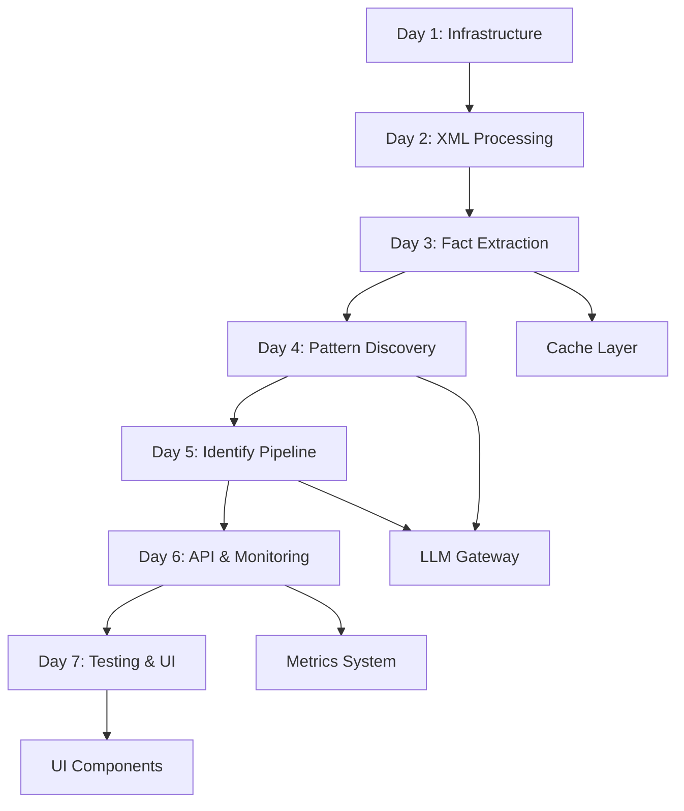

# AssistedDiscovery - Detailed Implementation Plan

## Phase-Based Implementation Strategy

### Phase 0: Foundation & Infrastructure (Days 1-2)

#### Day 1: Core Infrastructure
**Morning (4 hours)**
- [ ] Database schema setup and migration scripts
- [ ] Base MySQL connection and ORM models
- [ ] Environment configuration and secrets management
- [ ] Basic project structure and dependency management

**Afternoon (4 hours)**
- [ ] Seed `ndc_target_paths` table with OrderViewRS 17.2 targets
- [ ] Implement `ndc_path_aliases` with basic fallback rules
- [ ] Version/namespace detection from XML root elements
- [ ] Basic logging and configuration framework

**Dependencies:** None
**Deliverables:** Working database, basic config, version detection
**Risk Level:** Low

#### Day 2: XML Processing Core
**Morning (4 hours)**
- [ ] Implement `lxml.iterparse` streaming parser
- [ ] Build path-trie matching for target detection
- [ ] Create subtree extraction with memory bounds
- [ ] Implement local-name stack tracking

**Afternoon (4 hours)**
- [ ] Basic template extractor engine
- [ ] PII masking utilities (email, phone, date patterns)
- [ ] NodeFact data structure and validation
- [ ] Unit tests for core parsing logic

**Dependencies:** Day 1 database setup
**Deliverables:** Working XML stream parser with target matching
**Risk Level:** Medium (parsing complexity)

### Phase 1: Extraction & Storage (Day 3)

#### Day 3: Fact Extraction & Persistence
**Morning (4 hours)**
- [ ] Complete NodeFact extraction pipeline
- [ ] Implement PII server-side gate before DB insert
- [ ] AssociationFact extraction for basic ID/ref relationships
- [ ] Database persistence layer with transaction management

**Afternoon (4 hours)**
- [ ] In-memory caching for target paths and aliases
- [ ] Cache refresh mechanism (webhook + timer)
- [ ] Error handling for malformed XML and extraction failures
- [ ] Integration tests with sample XML files

**Dependencies:** Phase 0 complete
**Deliverables:** End-to-end extraction from XML to NodeFacts in DB
**Risk Level:** Medium (PII handling, caching complexity)

### Phase 2: Pattern Discovery (Day 4)

#### Day 4: LLM-Powered Discovery
**Morning (4 hours)**
- [ ] LLM Gateway abstraction with retry logic
- [ ] Discovery prompt templates and JSON schema validation
- [ ] Micro-batching logic (3-6 NodeFacts per call)
- [ ] Pattern normalization and signature generation

**Afternoon (4 hours)**
- [ ] Pattern deduplication by signature_hash
- [ ] Pattern persistence with examples and metadata
- [ ] Discovery pipeline orchestration
- [ ] Pattern quality validation and filtering

**Dependencies:** Phase 1 complete
**Deliverables:** Working Discovery flow from NodeFacts to Patterns
**Risk Level:** High (LLM integration, JSON schema compliance)

### Phase 3: Pattern Matching & Classification (Day 5)

#### Day 5: Identify Pipeline
**Morning (4 hours)**
- [ ] Top-K pattern retrieval with scoring algorithm
- [ ] Hard constraint validation (decision_rule enforcement)
- [ ] Pattern candidate filtering pipeline
- [ ] Database indexing for efficient pattern queries

**Afternoon (4 hours)**
- [ ] LLM classification prompt and response handling
- [ ] Pattern match persistence with confidence scores
- [ ] Gap Report generation (coverage, missing sections, violations)
- [ ] End-to-end Identify flow testing

**Dependencies:** Phase 2 complete
**Deliverables:** Complete Identify pipeline with Gap Reports
**Risk Level:** Medium (complex scoring algorithm, LLM reliability)

### Phase 4: API & Monitoring (Day 6)

#### Day 6: API Surface & Observability
**Morning (4 hours)**
- [ ] REST API endpoints for run management
- [ ] File upload handling (multipart and object store integration)
- [ ] Job status tracking and run management
- [ ] API authentication and rate limiting

**Afternoon (4 hours)**
- [ ] Metrics collection (Prometheus/StatsD integration)
- [ ] Logging standardization with structured format
- [ ] Error monitoring and alerting setup
- [ ] Performance profiling and bottleneck identification

**Dependencies:** Phase 3 complete
**Deliverables:** Full API with monitoring and observability
**Risk Level:** Low (standard web API patterns)

### Phase 5: Testing & Validation (Day 7)

#### Day 7: Quality Assurance & Documentation
**Morning (4 hours)**
- [ ] Comprehensive integration tests with real XML samples
- [ ] Golden test fixtures for deterministic LLM responses
- [ ] Load testing with large XML files (memory bounds verification)
- [ ] Performance benchmarking and optimization

**Afternoon (4 hours)**
- [ ] Basic Analyst UI for upload and report viewing
- [ ] Documentation and API reference generation
- [ ] Deployment runbooks and operational procedures
- [ ] Dry-run with 2-3 production-like XML samples

**Dependencies:** Phase 4 complete
**Deliverables:** Production-ready system with UI and docs
**Risk Level:** Low (testing and documentation)

## Dependency Graph

## Critical Path Analysis

**Critical Path:** Days 1→2→3→4→5 (Core functionality)
- **Total Duration:** 5 days
- **Buffer Time:** 2 days (Days 6-7 for polish)
- **Risk Mitigation:** Template extractor fallback if LLM integration fails

## Resource Requirements

### Development Team
- **1 Backend Engineer** (full-time): Core system, API, database
- **0.5 DevOps Engineer** (part-time): Infrastructure, monitoring, deployment
- **0.5 ML Engineer** (part-time): LLM integration, prompt engineering
- **0.5 QA Engineer** (part-time): Testing strategy, golden tests

### Infrastructure
- **Development Environment:**
  - MySQL 8.0 instance (4GB RAM)
  - Redis instance (2GB RAM) for caching
  - LLM API access (GPT-4 Turbo with sufficient quota)
  - Object storage for large XML files

- **Testing Environment:**
  - Scaled-down replica of production
  - Sample XML files (5-10 representative files, 1MB-50MB range)
  - Load testing tools (JMeter or Artillery)

## Risk Mitigation Strategies

### High-Risk Items
1. **LLM JSON Schema Compliance (Day 4)**
   - **Mitigation:** Implement repair prompts, strict validation, template fallback
   - **Contingency:** Use template extractors for all sections if LLM unreliable

2. **Token Limit Management (Days 4-5)**
   - **Mitigation:** Micro-batching, subtree size limits, model switching
   - **Contingency:** Reduce batch sizes, implement aggressive truncation

3. **Performance at Scale (Day 7)**
   - **Mitigation:** Memory profiling, streaming optimizations, worker scaling
   - **Contingency:** Implement file size limits, async processing queue

### Medium-Risk Items
1. **PII Masking Completeness (Day 3)**
   - **Mitigation:** Comprehensive regex testing, server-side validation
   - **Contingency:** Conservative masking (over-mask rather than under-mask)

2. **Pattern Signature Collisions (Day 4)**
   - **Mitigation:** Rich signature content, collision detection, manual review
   - **Contingency:** Add timestamp or run_id to signature for uniqueness

## Success Criteria

### Functional Requirements
- [ ] Parse OrderViewRS 17.2 XML files without memory issues
- [ ] Extract NodeFacts with >95% PII masking success
- [ ] Generate deterministic pattern signatures (same XML → same patterns)
- [ ] Identify patterns with >70% average confidence
- [ ] Generate gap reports with coverage metrics

### Performance Requirements
- [ ] Process 10MB XML file in <5 minutes
- [ ] Memory usage stays <2GB during processing
- [ ] LLM token usage <50K tokens per MB of XML
- [ ] API response time <30s for status queries

### Quality Requirements
- [ ] >95% test coverage for core extraction logic
- [ ] Zero PII leaks in stored NodeFacts
- [ ] <5% false positive rate in pattern matching
- [ ] Graceful degradation when LLM unavailable

## Post-MVP Roadmap

### Week 2-3: Production Hardening
- [ ] Multi-airline support with path aliases
- [ ] Horizontal scaling implementation
- [ ] Circuit breakers and advanced retry logic
- [ ] Comprehensive monitoring dashboard

### Month 2: Advanced Features
- [ ] Embeddings-based pattern retrieval
- [ ] Cross-message pattern correlation
- [ ] Advanced PII detection (ML-based)
- [ ] Pattern evolution tracking

### Month 3: Enterprise Features
- [ ] Multi-tenancy support
- [ ] Custom extraction rules per airline
- [ ] Audit trails and compliance features
- [ ] Advanced analytics and insights