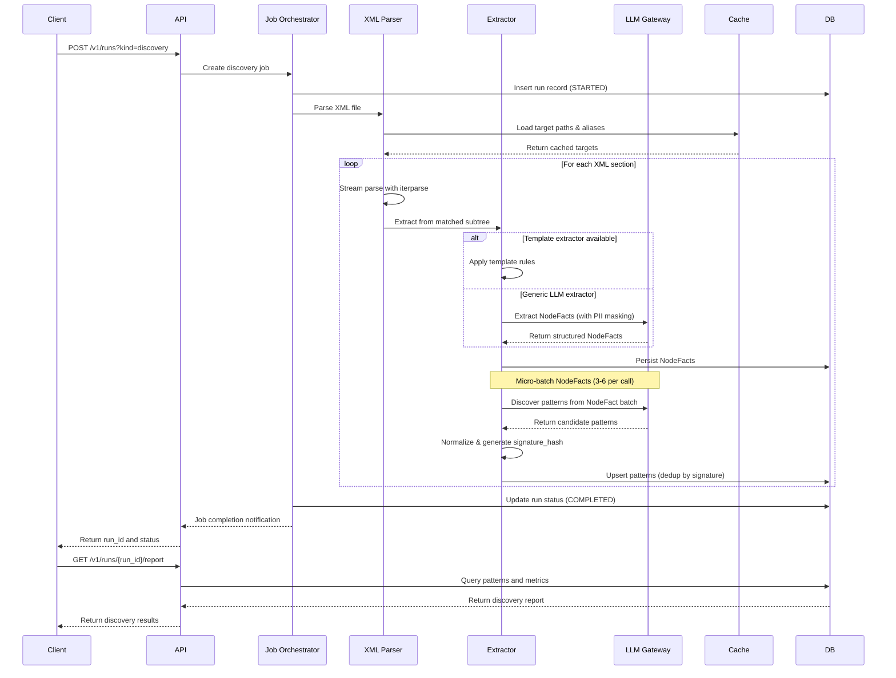
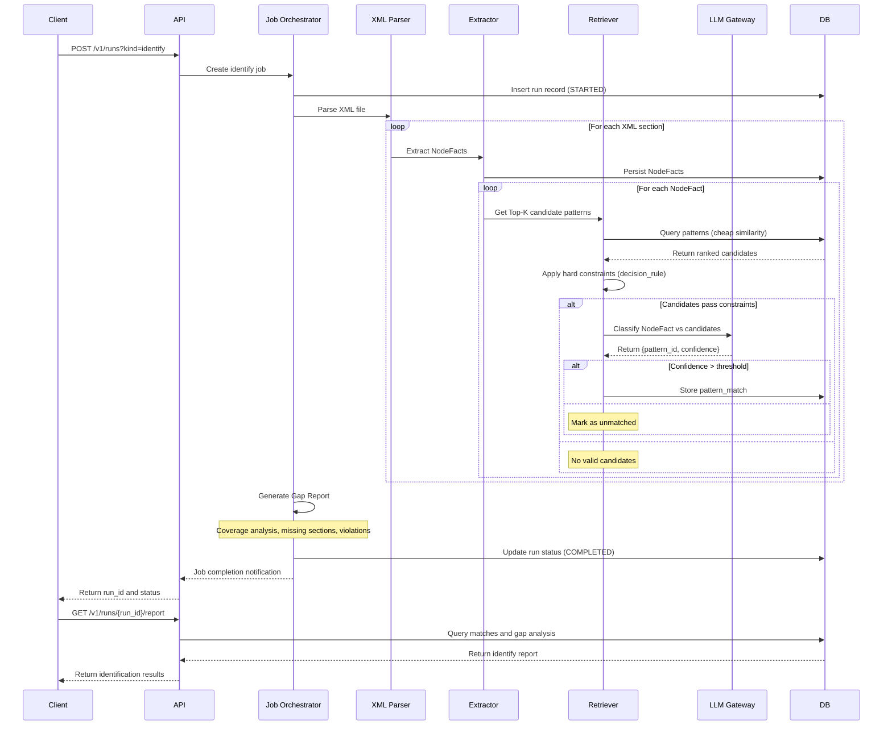
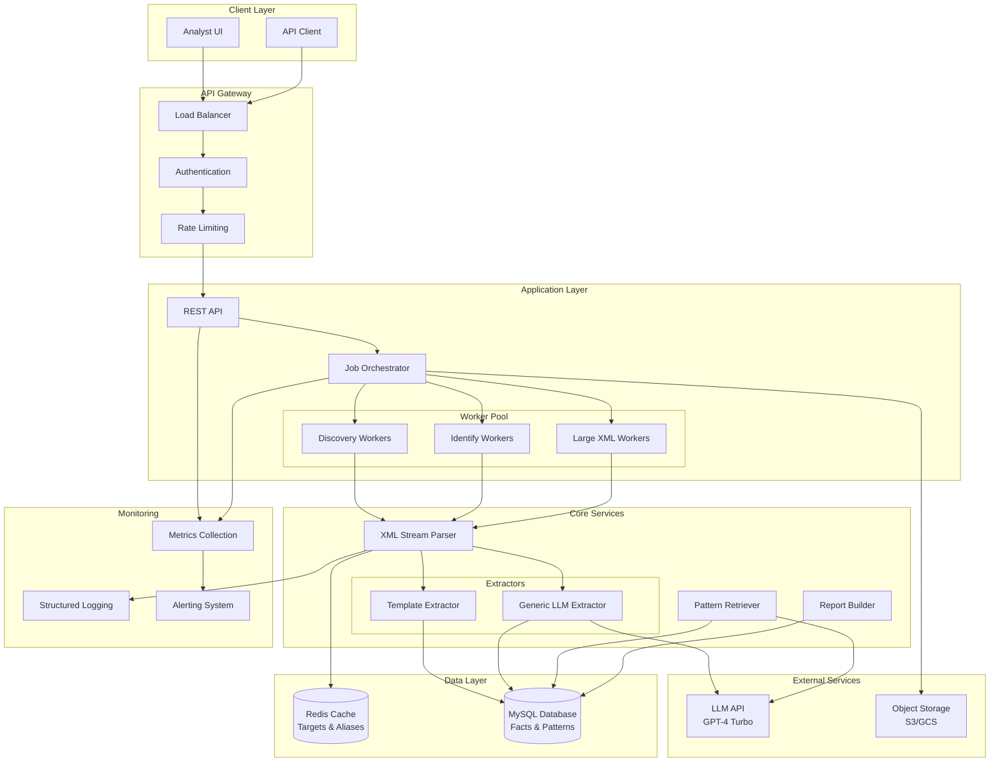
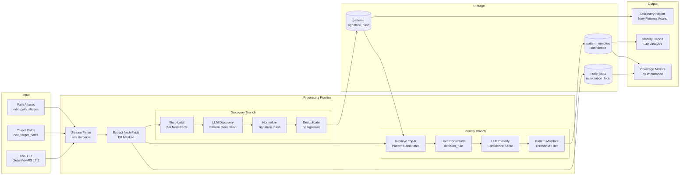
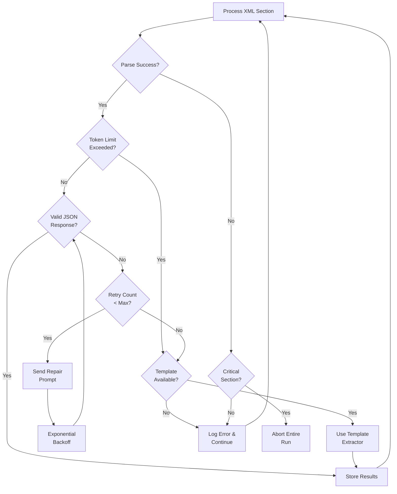
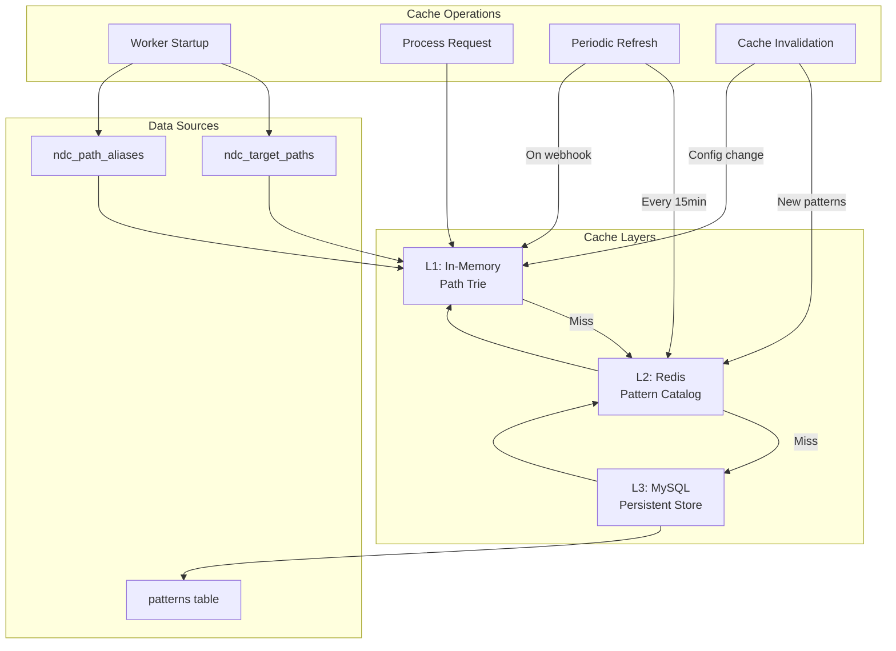

# AssistedDiscovery - System Diagrams

## Discovery Flow Sequence Diagram

## Identify Flow Sequence Diagram

## System Architecture Flowchart

## Data Flow Diagram

## Error Handling Flow

## Caching Strategy Diagram

