# AssistedDiscovery - System Diagrams

**Last Updated**: 2025-10-29
**Note**: All diagrams reflect the current implementation with SQLite workspace databases and Azure OpenAI GPT-4o

## ⚠️ Terminology Note

**UI vs Backend Naming**:
- **UI: "Pattern Extractor"** → Backend: `DiscoveryWorkflow` service
- **UI: "Discovery"** → Backend: `IdentifyWorkflow` service

This document uses **UI terminology** for user-facing descriptions but references actual backend class names for code accuracy.

## Table of Contents
1. [Pattern Extractor Flow (Backend: Discovery)](#pattern-extractor-flow-backend-discovery)
2. [Discovery Flow (Backend: Identify)](#discovery-flow-backend-identify)
3. [System Architecture Overview](#system-architecture-overview)
4. [Component Architecture](#component-architecture)
5. [Class Diagrams](#class-diagrams)
6. [Database Schema Relationships](#database-schema-relationships)
7. [Data Flow Diagram](#data-flow-diagram)
8. [Error Handling Flow](#error-handling-flow)
9. [Workspace Architecture](#workspace-architecture)

---

## Pattern Extractor Flow (Backend: Discovery)

**Purpose**: Extract patterns from airline XML files to build a pattern library.

**Backend Service**: `DiscoveryWorkflow` (code name: "discovery")
**UI Page**: 🔬 Pattern Extractor
**API Endpoint**: `/api/v1/runs` with `kind=discovery`

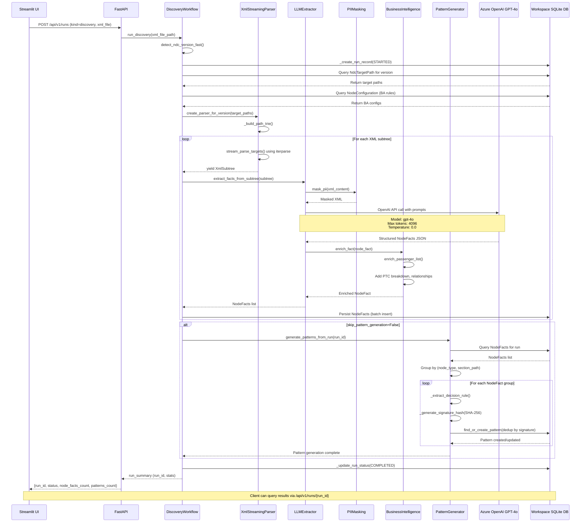

## Discovery Flow (Backend: Identify)

**Purpose**: Discover differences in new airline XML by validating against known patterns.

**Backend Service**: `IdentifyWorkflow` (code name: "identify")
**UI Page**: 🎯 Discovery
**API Endpoint**: `/api/v1/runs` with `kind=identify`

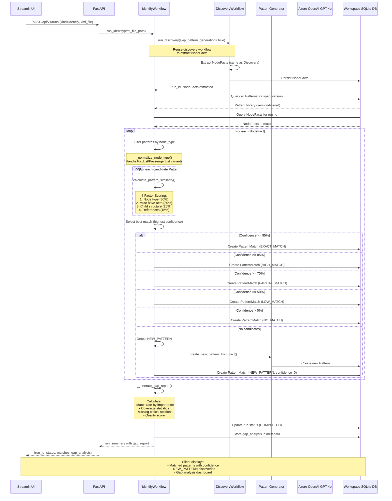

## System Architecture Overview

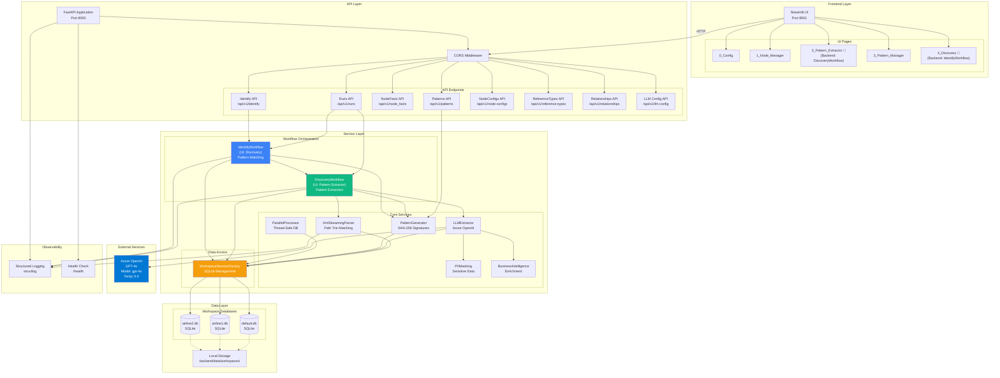

---

## Component Architecture

### Backend Component Diagram

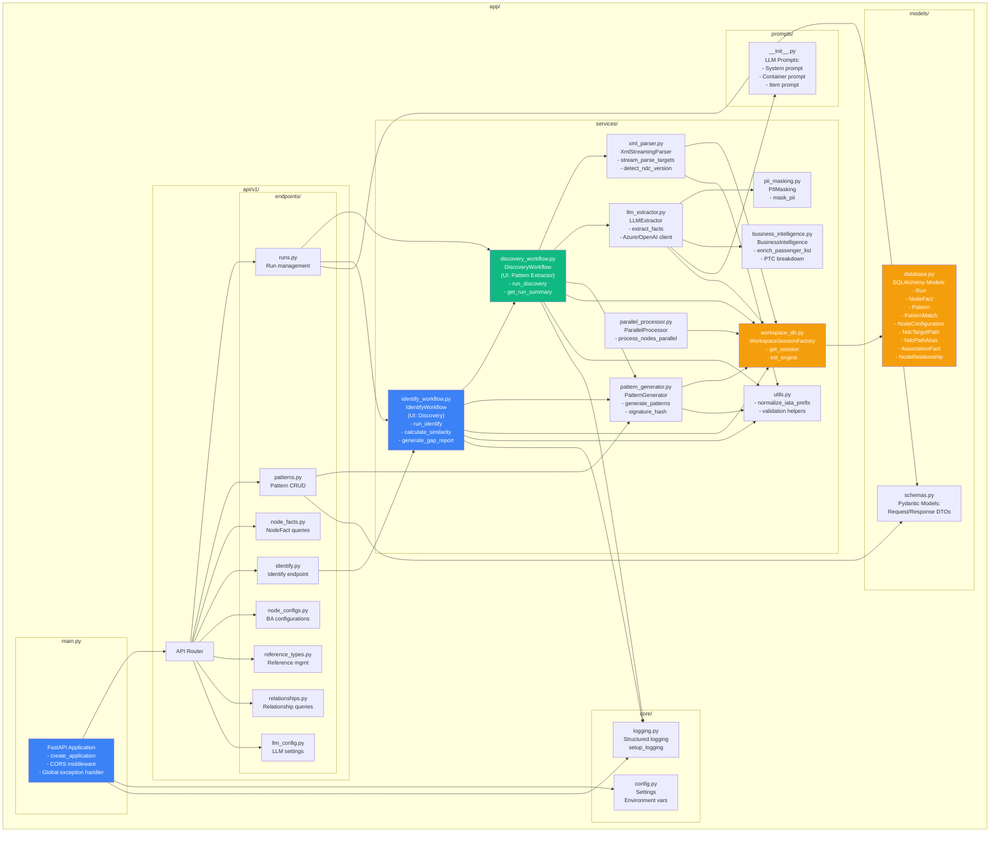

---

## Class Diagrams

### Core Transactional Models

**Note**: These models represent the primary data entities with transactional relationships.

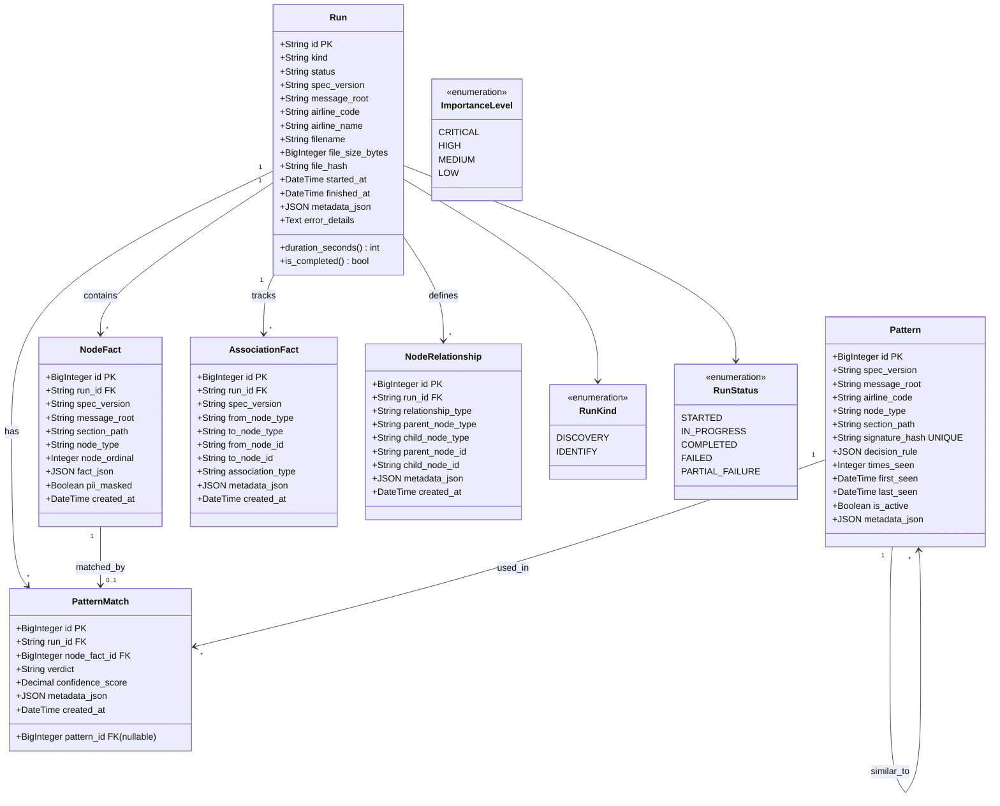

### Configuration & Lookup Models

**Note**: These models store system configuration and are queried by services, but have no foreign key relationships to transactional data.

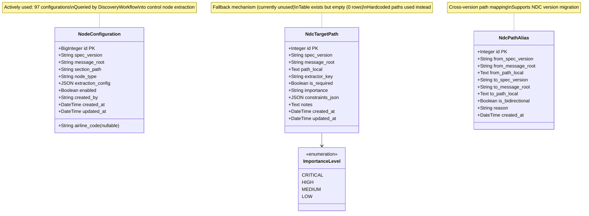

### Service Layer Classes

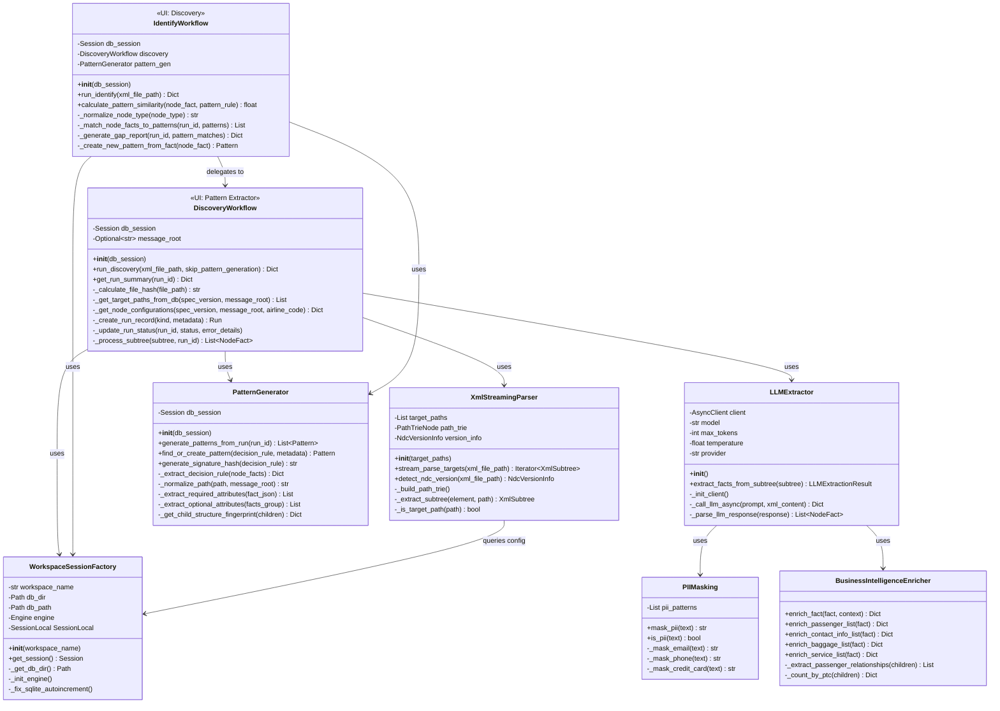

---

## Database Schema Relationships

### Transactional Data Schema

**Note**: Shows foreign key relationships between core entities.

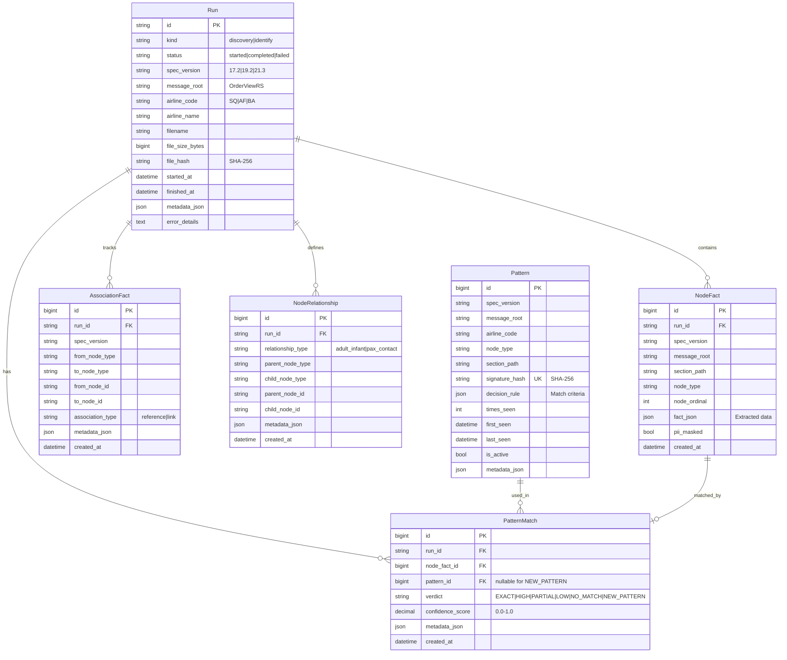

### Configuration & Lookup Schema

**Note**: These tables store system configuration with no foreign key relationships. Queried by services but not related to transactional data.

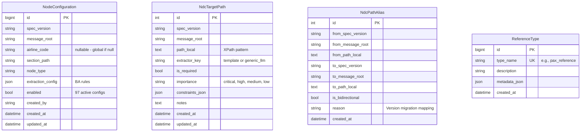

**Usage Notes**:
- **NodeConfiguration**: Actively used (97 rows). Queried by `DiscoveryWorkflow._should_extract_node()` to control node extraction. Has API: `/api/v1/node-configs`.
- **NdcTargetPath**: Fallback mechanism (0 rows - empty). Code queries it but uses hardcoded paths. Designed for dynamic configuration.
- **NdcPathAlias**: Cross-version path mapping. Supports NDC version migration scenarios.
- **ReferenceType**: Lookup table for relationship types used by `NodeRelationship`.

---

## Data Flow Diagram

### Pattern Extractor Data Flow (Backend: Discovery)

```mermaid
flowchart LR
    subgraph "Input"
        XML["NDC XML File<br/>17.2/19.2/21.3"]
        ConfigDB[(Configuration DB<br/>NdcTargetPath<br/>NodeConfiguration)]
    end

    subgraph "XML Processing"
        Detect[Version Detection<br/>detect_ndc_version_fast]
        Parser[Streaming Parser<br/>Path Trie Matching]
        Subtree[XML Subtrees<br/>4KB chunks]
    end

    subgraph "Extraction & Enrichment"
        PIIMask[PII Masking<br/>Email, Phone, CC]
        LLMExt[Azure OpenAI<br/>GPT-4o Extraction]
        BIEnrich[Business Intelligence<br/>PTC, Relationships]
        NodeFacts[NodeFacts<br/>Structured JSON]
    end

    subgraph "Pattern Generation"
        Group[Group by<br/>node_type + section]
        DecRule[Extract Decision Rule<br/>must_have/optional attrs]
        SigHash[Generate Signature<br/>SHA-256 hash]
        Dedup[Deduplicate<br/>by signature_hash]
    end

    subgraph "Storage"
        RunDB[(Run<br/>Metadata)]
        NodeDB[(NodeFact<br/>Extracted Data)]
        PatternDB[(Pattern<br/>Decision Rules)]
    end

    subgraph "Output"
        Summary[Run Summary<br/>Stats & Metrics]
        Report[Pattern Report<br/>Discovered Patterns]
    end

    XML --> Detect
    ConfigDB --> Parser
    Detect --> Parser
    Parser --> Subtree

    Subtree --> PIIMask
    PIIMask --> LLMExt
    LLMExt --> BIEnrich
    BIEnrich --> NodeFacts

    NodeFacts --> NodeDB
    NodeFacts --> Group

    Group --> DecRule
    DecRule --> SigHash
    SigHash --> Dedup
    Dedup --> PatternDB

    Detect --> RunDB
    NodeDB --> Summary
    PatternDB --> Report

    style LLMExt fill:#0078D4,color:#fff
    style PatternDB fill:#10b981,color:#fff
    style NodeDB fill:#3b82f6,color:#fff
```

### Discovery Data Flow (Backend: Identify)

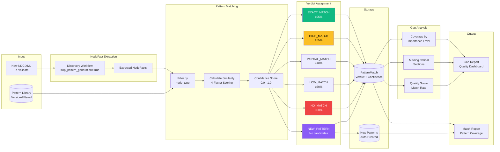

## Error Handling Flow

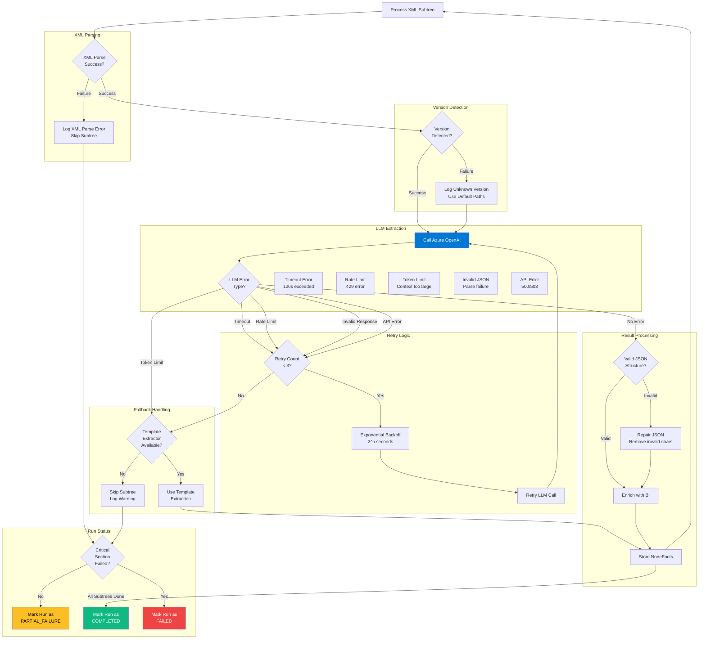

---

## Workspace Architecture

### Workspace Isolation Design

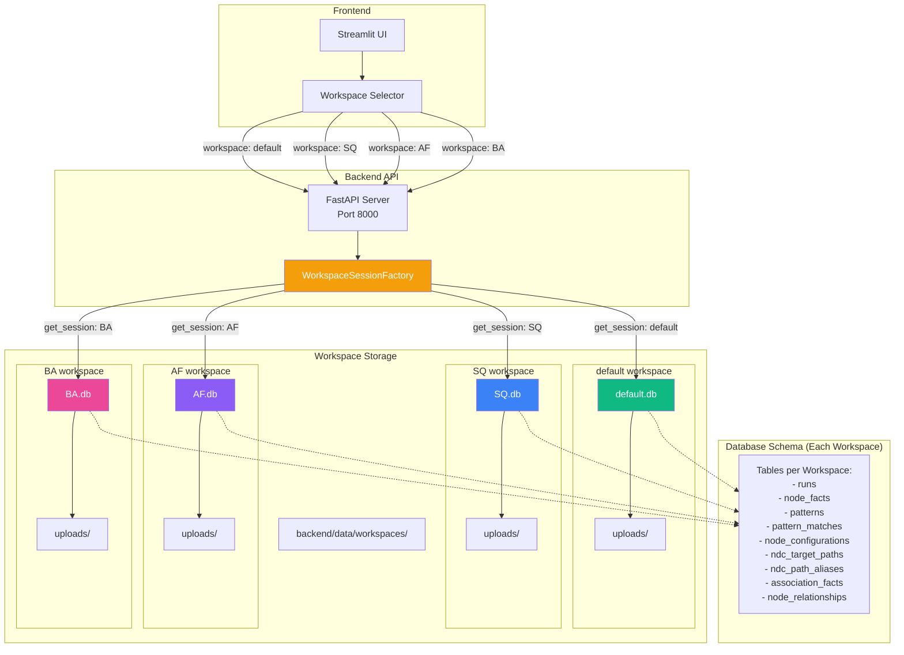

### Workspace Characteristics

**Complete Isolation**:
- Each workspace has its own SQLite database file
- No shared data between workspaces
- Patterns are workspace-specific (airline-specific patterns)
- Runs and NodeFacts are scoped to workspace

**Use Cases**:
1. **default**: Generic patterns, multi-airline testing
2. **SQ**: Singapore Airlines patterns and runs
3. **AF**: Air France patterns and runs
4. **BA**: British Airways patterns and runs

**Advantages**:
- Data isolation for different clients/airlines
- Pattern libraries don't interfere
- Easy backup/restore per workspace
- Portable (copy .db file)
- No cross-workspace queries (security)

**Database Initialization**:
- Databases created on-demand when workspace is first accessed
- Schema automatically created via SQLAlchemy `Base.metadata.create_all()`
- Foreign key constraints enabled via PRAGMA
- AUTOINCREMENT fixed for SQLite compatibility

---

## Storage Structure

### Directory Layout

```
ad/
├── backend/
│   ├── data/
│   │   └── workspaces/          # Workspace databases
│   │       ├── default.db       # Default workspace SQLite
│   │       ├── SQ.db           # Singapore Airlines workspace
│   │       ├── AF.db           # Air France workspace
│   │       └── BA.db           # British Airways workspace
│   │
│   ├── app/
│   │   ├── main.py              # FastAPI application
│   │   ├── api/                 # API endpoints
│   │   ├── services/            # Business logic
│   │   ├── models/              # Data models
│   │   ├── core/                # Config & logging
│   │   └── prompts/             # LLM prompts
│   │
│   └── tests/
│       ├── unit/                # Unit tests
│       └── integration/         # Integration tests
│
├── frontend/
│   └── streamlit_ui/
│       ├── AssistedDiscovery.py # Main Streamlit app
│       ├── pages/               # UI pages
│       │   ├── 0_Config.py
│       │   ├── 1_Node_Manager.py
│       │   ├── 2_Pattern_Extractor.py  # Pattern extraction (uses DiscoveryWorkflow)
│       │   ├── 3_Pattern_Manager.py
│       │   └── 4_Discovery.py          # Pattern validation (uses IdentifyWorkflow)
│       └── utils/               # UI utilities
│
└── docs/                        # Documentation
    ├── System_Diagrams.md       # This file
    ├── CLAUDE.md                # Project context
    ├── README.md                # Quick start
    └── ...
```

### Database File Structure

Each workspace SQLite database contains:

```
workspace.db (SQLite)
├── runs                    # Processing runs (discovery/identify)
├── node_facts              # Extracted XML node information
├── patterns                # Learned patterns (signature_hash unique)
├── pattern_matches         # Pattern matching results
├── node_configurations     # BA-configured extraction rules
├── ndc_target_paths        # NDC version target paths
├── ndc_path_aliases        # Cross-version path aliases
├── association_facts       # Cross-references between nodes
└── node_relationships      # Business relationships (e.g., adult-infant)
```

**File Sizes** (typical):
- Empty database: ~100 KB
- After 1 discovery run (10 MB XML): ~5-10 MB
- After 100 patterns generated: ~2-3 MB
- After 10 identify runs: ~15-20 MB

**Backup Strategy**:
- Simple: Copy `.db` file
- Recommended: `sqlite3 workspace.db .dump > backup.sql`
- Cloud sync compatible (Dropbox, Google Drive)

---

## Performance Characteristics

### Memory Usage

**XML Streaming Parser**:
- Memory-bounded: Processes 4KB subtrees
- Large files (100MB+) use constant memory ~500MB
- No full document load into memory

**LLM Extraction**:
- Per-subtree extraction: ~1-5 MB context
- Azure OpenAI limits: 128K tokens input
- Batch processing: 10-20 subtrees concurrently

**Database**:
- SQLite cache: ~2GB default
- Connection pool: StaticPool (single connection)
- Write batch size: 50-100 NodeFacts per transaction

### Processing Speed

**Typical Performance** (measured):
- Small XML (1 MB): 30-60 seconds
- Medium XML (10 MB): 5-8 minutes
- Large XML (50 MB): 20-30 minutes

**Bottlenecks**:
1. Azure OpenAI API calls (rate limits, latency)
2. JSON parsing and validation
3. Database write transactions

**Optimization Strategies**:
- Parallel subtree processing (4-8 workers)
- Batch database inserts
- Connection pooling
- Response caching (future)

### Cost Estimation

**Azure OpenAI Costs** (GPT-4o):
- Input tokens: $0.005 per 1K tokens
- Output tokens: $0.015 per 1K tokens
- Average: $0.50 - $2.00 per 10 MB XML
- Discovery runs (IdentifyWorkflow): $0.10 - $0.50 per run (fewer LLM calls)

**Storage Costs**:
- SQLite: Free (local storage)
- Cloud backup: Depends on provider
- Average workspace size: 50-200 MB

---

## Summary

This document provides comprehensive architectural diagrams for the AssistedDiscovery system, including:

✅ **Sequence Diagrams**: Pattern Extractor and Discovery workflows with actual service calls
✅ **System Architecture**: Complete component view with FastAPI, services, and Azure OpenAI
✅ **Component Diagrams**: Backend structure with all modules and dependencies
✅ **Class Diagrams**: Data models and service classes with methods
✅ **Database Schema**: ER diagrams showing all relationships
✅ **Data Flow**: Separate flows for Pattern Extractor and Discovery processes
✅ **Error Handling**: Comprehensive error handling with retry logic
✅ **Workspace Architecture**: SQLite-based isolation design
✅ **Performance Notes**: Memory, speed, and cost characteristics

**Key Technologies**:
- **Backend**: FastAPI, SQLAlchemy, lxml, Azure OpenAI GPT-4o
- **Frontend**: Streamlit
- **Database**: SQLite (workspace-based isolation)
- **LLM**: Azure OpenAI GPT-4o (not OpenAI)
- **Logging**: structlog

**Last Updated**: 2025-10-29
**Reflects**: Current implementation in `ad/` codebase