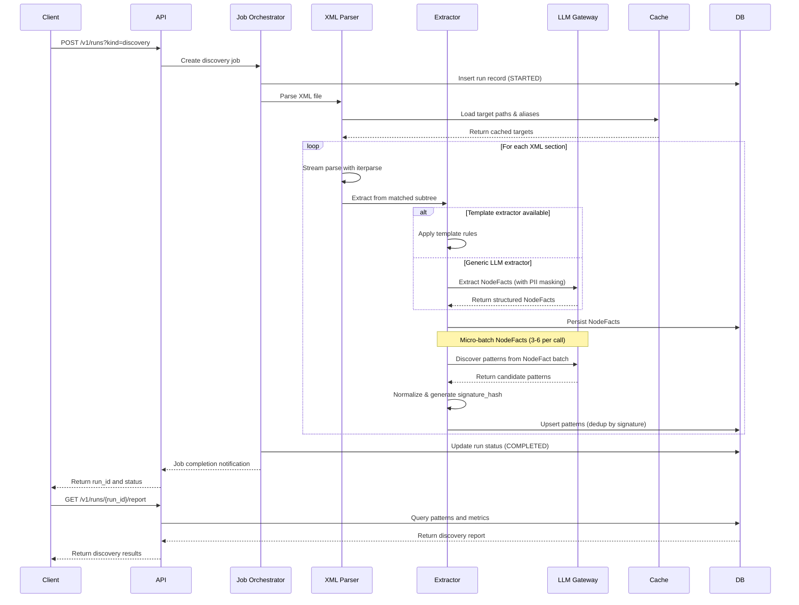
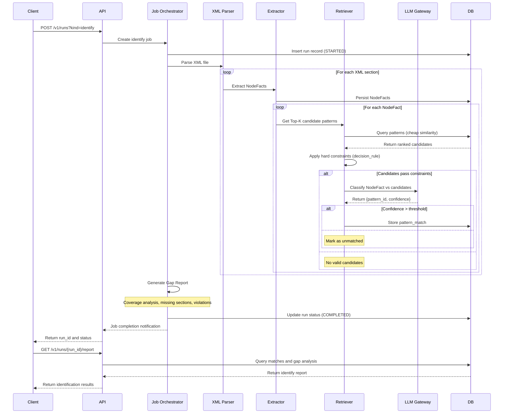
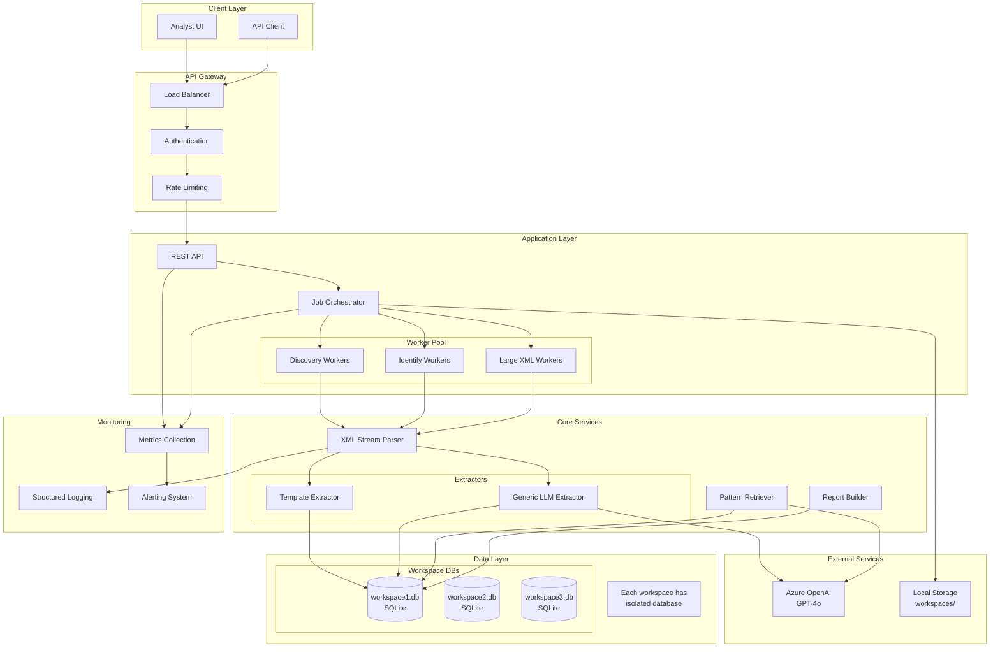
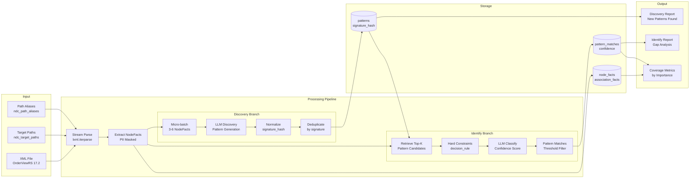
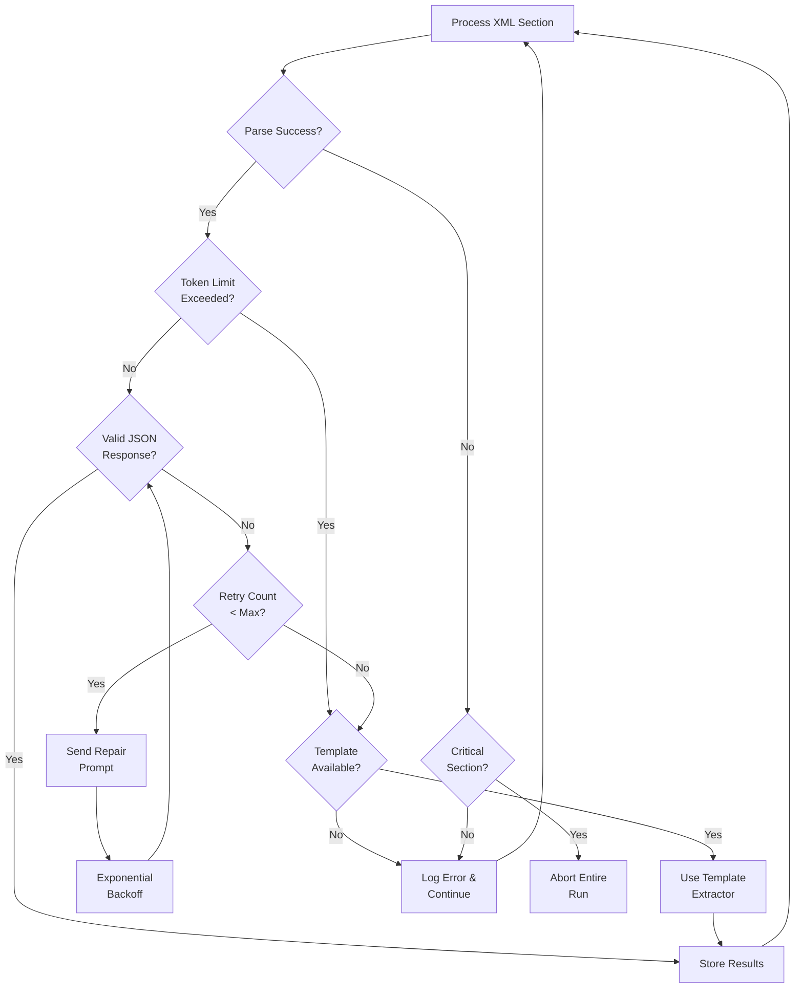

# AssistedDiscovery - System Diagrams

## Discovery Flow Sequence Diagram



## Identify Flow Sequence Diagram



## System Architecture Flowchart



## Data Flow Diagram



## Error Handling Flow



## Workspace Architecture Diagram

```mermaid
flowchart TD
    subgraph "Application Layer"
        API[FastAPI Application]
        SessionMgr[Session Manager]
    end

    subgraph "Workspace Isolation"
        WS1[Workspace: default]
        WS2[Workspace: airline1]
        WS3[Workspace: airline2]
    end

    subgraph "SQLite Databases"
        DB1[(default/workspace.db<br/>Runs, NodeFacts,<br/>Patterns, Matches)]
        DB2[(airline1/workspace.db<br/>Runs, NodeFacts,<br/>Patterns, Matches)]
        DB3[(airline2/workspace.db<br/>Runs, NodeFacts,<br/>Patterns, Matches)]
    end

    API --> SessionMgr
    SessionMgr -->|get_session("default")| WS1
    SessionMgr -->|get_session("airline1")| WS2
    SessionMgr -->|get_session("airline2")| WS3

    WS1 --> DB1
    WS2 --> DB2
    WS3 --> DB3

    Note1[Each workspace is<br/>completely isolated]
    Note2[No cross-workspace<br/>data access]
    Note3[Patterns are<br/>workspace-specific]
```

## Storage Structure

```
workspaces/
├── default/
│   ├── workspace.db          # SQLite database
│   └── uploads/              # XML files
├── airline1/
│   ├── workspace.db
│   └── uploads/
└── airline2/
    ├── workspace.db
    └── uploads/
```